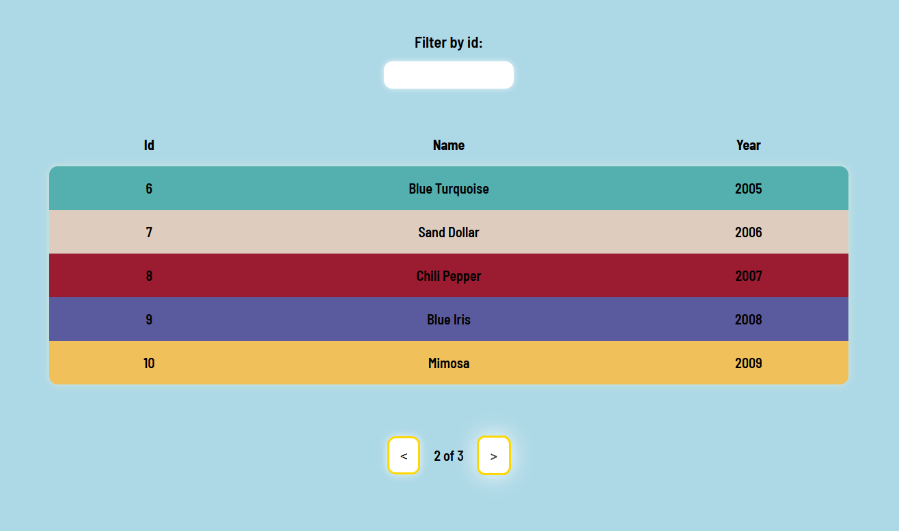

# Codibly recruitment task



## About

Simple web app that uses example API. Created with React and TypeScript. You can switch pages with pagination buttons and filter content by id. App reflects filtering and pagination in URL.

## Setup

Clone this repository, install packages and run server. 

```
cd ./codibly-recruitment-task
npm install
...
npm start
```
